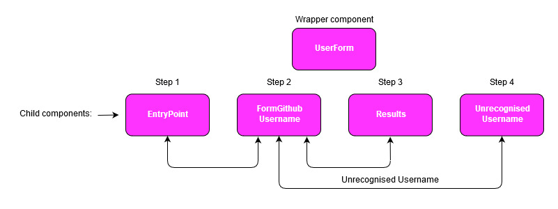

# Github User Favourite Programming Languages

Simple, single-page, web app created using React.js. The app takes a Github username as an input and returns what that user's most likely favourite programming language is.

### Getting started

Clone the repo, navigate to the root directory and run `npm install` to install the dependencies. Run `npm start` to start it in development mode (localhost:3000).

To use the program, follow the links and enter a valid Github username into the relevant field.

### Page design

For this I have used material-ui with just a few button and colour tweaks.

### Code design


The interactive components are accessed through a wrapper component ("UserForm.js") which has a `step` counter which renders the correct 'page' depending on user input and button clicks.

Requests to the [Github API](https://developer.github.com/v3/) are made using axios GET requests. On clicking "continue" after the user has inputted a Github username, the api request is made and the data received is processed in order to set three values to state. These values are for the totals number of repos, the most popular programming language and the number of repos that the user has with their favourite language as the main language. These values are displayed on the next page.

### User stories

```
As a user,
I want to be able to see a Github user's favourite language.
```
```
As a user,
I want to be able to easily check as many usernames as I like.
```
```
As a user,
I want to be informed if the username I have entered does not exist.
```
#### Extra user stories
```
As a user,
I want to be able to see how many repositories the Github user has.
```
```
As a user,
I want to know how many of those repositories use their favourite language as the main language.
```

### Edge cases

-  In the `setStateVariables` method in `UserForm`, when any of `language`, `frequency` or `totalRepos` are returned with falsey values (for example if someone's account contains only one repo with a document written in MD - the api returns `languages` as empty in this case), the variables are populated with the phrase 'insufficient data'.

- If the Github username does not exist, the `UnrecognisedUsername` component is rendered and the user has the chance to try again.

### Unresolved edge case

- I have not dealt with cases where more than one language is the most popular in the Github user's account. In this case only one language will be displayed.

### Limitations

The app only considers the first 100 repositories (alphabetically speaking). This is because the api is paginated. I have set it to return the max number per page (100), but have not built in a way to call all of the pages of a particular user and combine the results.

The only way around this would be to send a request that returns information including how many pages (at 100 per page) there are for that particular user. All pages could then be called and a more accurate calculation of the user's favourite language could be implemented.
